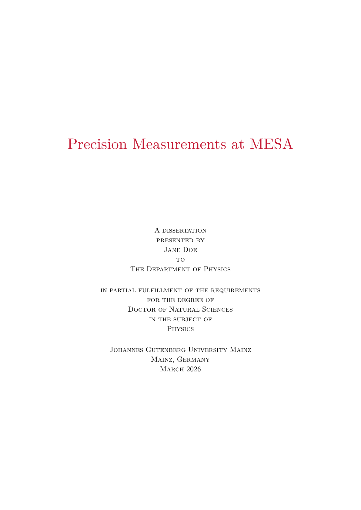
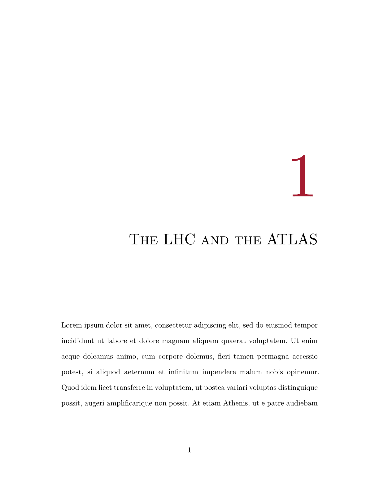

# A Typst Thesis Template for the JGU Mainz
This is an **unofficial** MINT-focused thesis template for the Johannes Gutenberg University Mainz, adopted from [Jerry Ling's Harvard GSAS template](https://github.com/Moelf/harvard-gsas-thesis-oat).

<div align="center" style="display:flex; gap:1rem; justify-content:center;">
  
  
</div>


# Installation

Download the [latest release](https://github.com/inverted-tree/jgu-thesis/releases/latest), or clone the repository and run:

```sh
just install
```

This copies the package into the Typst local packages directory for your OS. You can then import it in any Typst project using the `@local` namespace:

```typst
#import "@local/jgu-mint-thesis:0.1.5": *
```

# Changelog

## 0.1.5
- `Chapter` and `Section` are used for supplement correctly

## 0.1.4
- Added `appendix()` function for appendix, which resets numbering to start with `A.`
- fix equation numbering style to include `()`

## 0.1.3
- Improved figure caption alignment, size, and separation

## 0.1.2
- Fixed title style
- Added Numbering for equations and figures
- Improved margin

## 0.1.1
- Added `creative_commons` option for front matter
- Fixed title printing just before Abstract
- Fixed inconsistent small caps
- Fixed fill for entries in the ToC
- added color for reference and URL to be the school color
